# Deploying-microserviceapp

1) Login to AWS account && Create s3 buckend and enable versioning
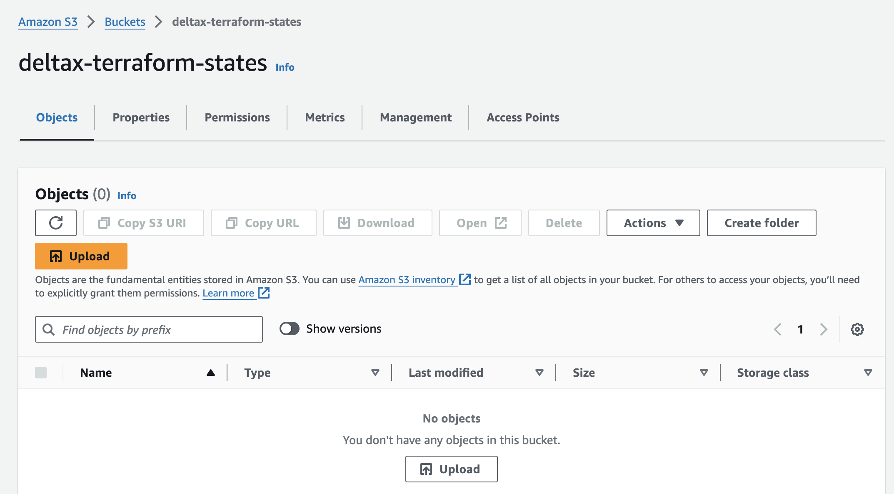

2) Create Dynamo DB table with partition key LockID of type string
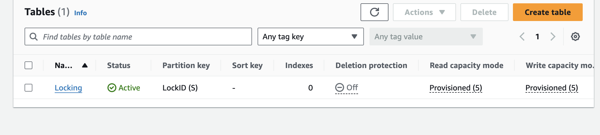

3) Run terraform init to install provider plugins and initalize backend

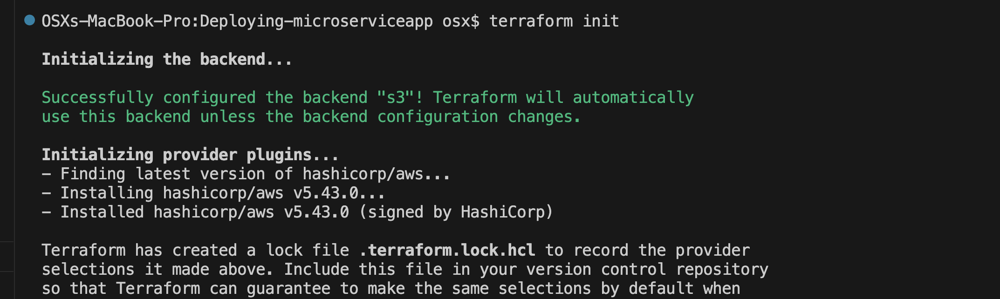

3) write module for vpc ,import it on main.tf and apply

$ terraform init  
$terraform apply

Now statefile will be created ,stored on s3 and vpc will be created
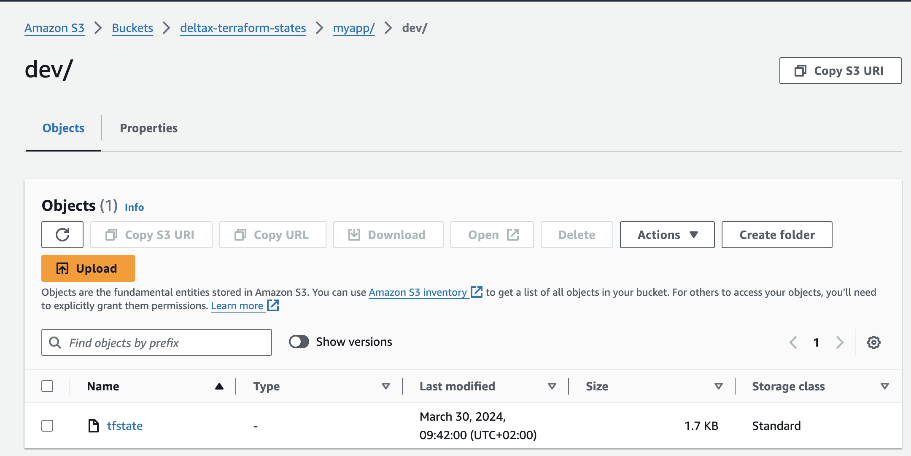

4) Create Security group for public instances
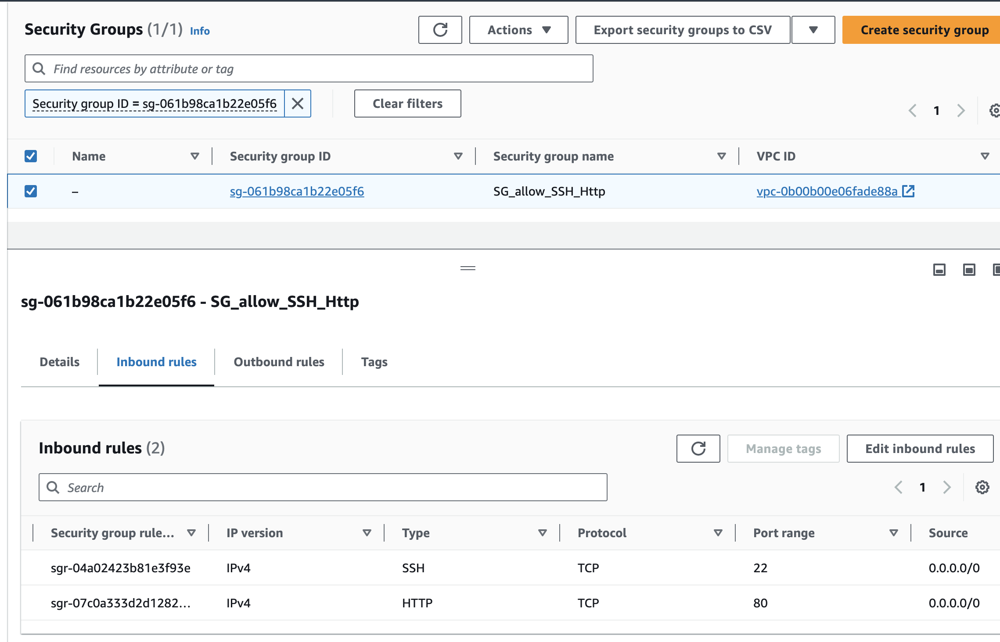

5) create public-instances
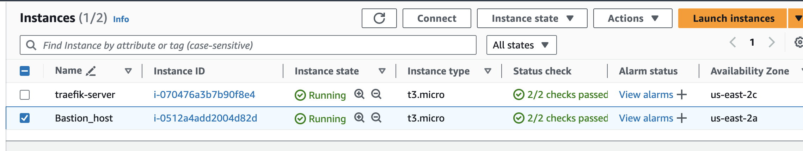

6) Create 3 private instances 
  a) server that has minikube and jenkins running on it
  b) dev server has node js
  c) server has mysql
Please note the selected instances are private instances
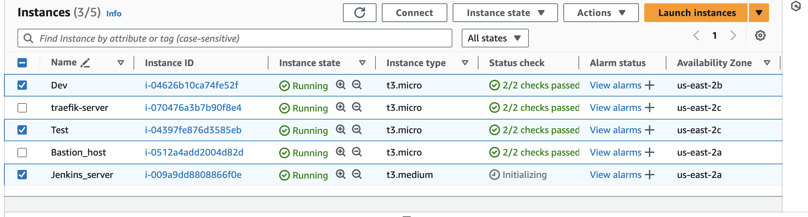

7) ssh to Jenkins_server through bastion host and do the following
    a) install minikube && start it
    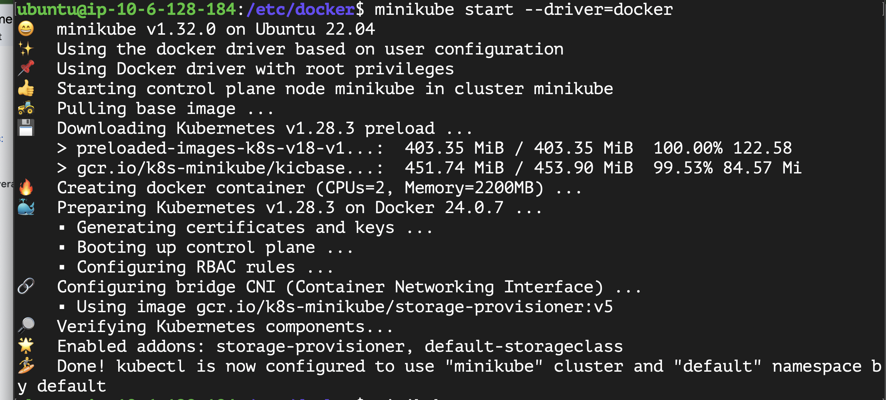
    b)check status of minikube and get nodes on cluster
    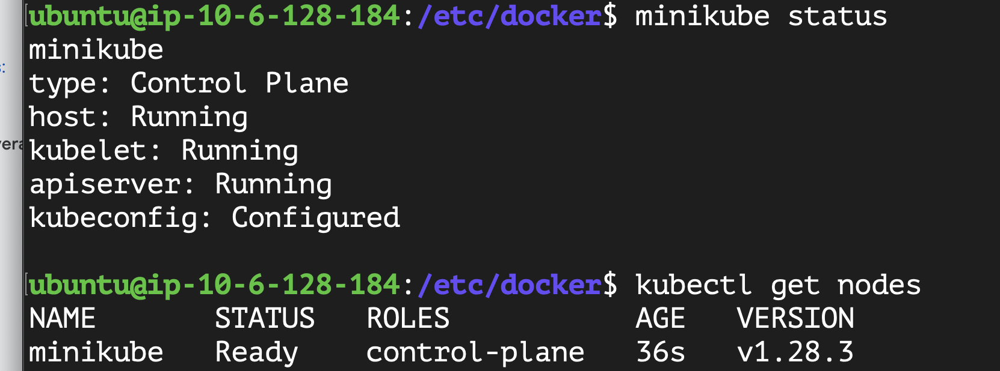
    c) create 3 namespaces (build,dev,test)
    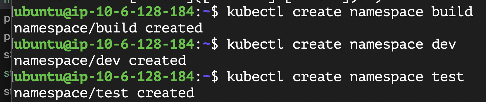
    d) list available namespaces on cluster
    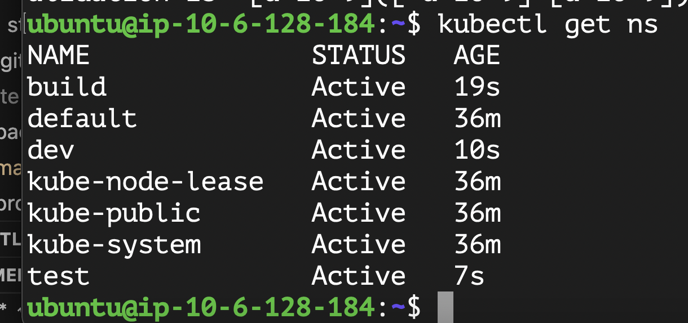
    

https://alex.dzyoba.com/blog/terraform-ansible/

