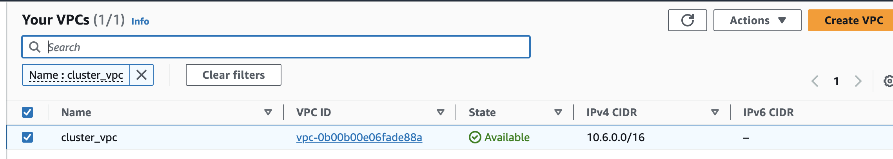

# Deploying-microserviceapp

1) Login to AWS account && Create s3 buckend and enable versioning

2) Create Dynamo DB table with partition key LockID of type string

3) Run terraform init to install provider plugins and initalize backend

3) write module for vpc ,import it on main.tf and apply

$ terraform init  
$terraform apply

Now statefile will be created ,stored on s3 and vpc will be created

https://alex.dzyoba.com/blog/terraform-ansible/

